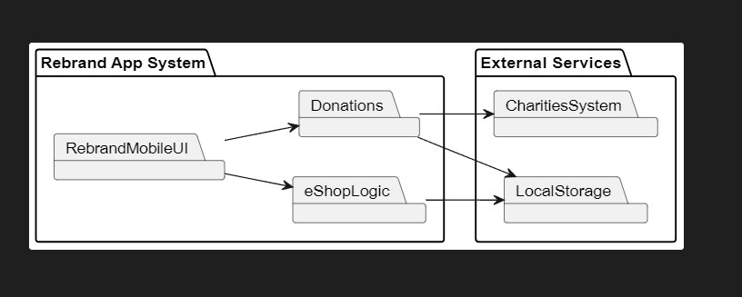
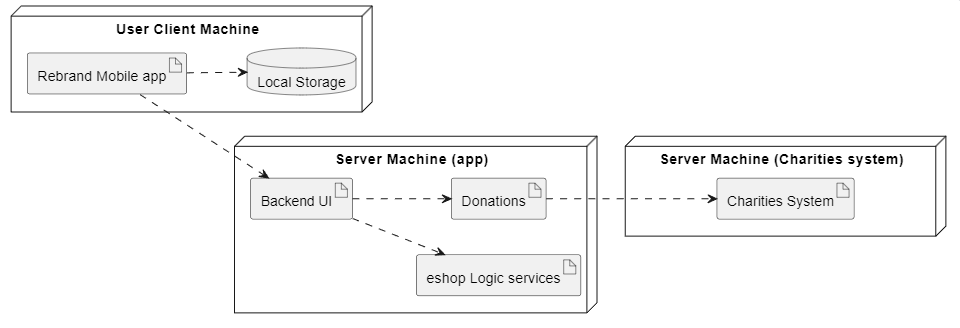

## Logical Architecture

The Rebrand Mobile UI is where we view the application's pages. The eShop Logic is where we will be able to manage the data of the products that we are selling and the users are able to buy. Donations is where we mange the money or clothes donations given by the users which they will be sent to the external services of the charities. This will be done After we save their data to a local storage in order to keep track of donations and inform the users about their contributions

## Physical Architecture

The physical layout diagram illustrates three nodes, depicting the tangible devices involved in the project and their interconnections.
The initial node corresponds to the User Client Machine, denoted by the Rebrand mobile app module and the device's internal storage. This storage is utilized for storing important information (profiles,emails,orders..) generated by the application.
The second node represents the Server Machine(app), responsible for hosting the backend of the Rebrand application. Serving as a mediator between the User Client machine and the charities system, it handles user orders, donations and users requests.
The final node denotes the Server Machine(charity system), tasked with furnishing the requested information for the services. 