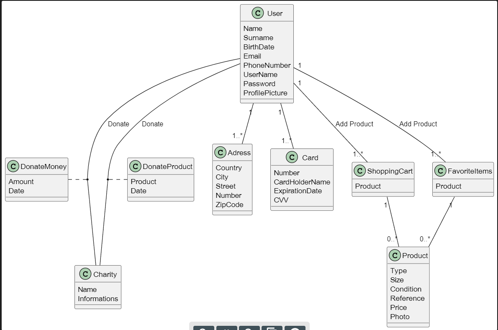

## User Stories

1. As a client I want to have a button to add a product to my current purchase So that I can continue my shopping.
2. As a client I want a button to access to my current purchase So that I can see all the products that I have intention to purchase.
3. As a user I want to be able to access my profile So that I can see my information and the amount of points I have.
4. As a user that want to donate clothes I want to have a schematic representation of the process of donation So that my donation can be easy and unbothered.
5. As a donor I want to have point in thread of discounts So that I feel motivated to donate money or clothes that I no longer use.
6. As a client I want to be informed how much I contributed to the planet with my purchase So that I can see the value of my actions.
7. As a client I want to have a search bar So that I can find specific items.
8. As a client I want to know the total and individual price of the items that I have intention to purchase So that I can make a better decision.
9. As a client I want to be able to make logon with a password and a username So that I can easily access my information on any device.
10. As a client I want to have access to a description about the product available for shopping in order to see if it is suitable for me.
11. As a client I want to have access to information of the charity organizations available for me to donate So that I can make a donation to the cause that I identify most with.
12. A a user I want to be able to choose my donations So that I can decide between donating clothes or money
13. As a client I want a button to access all my favorite product So that I can visualize all the products that I am unsure.
14. As a client I want a button to select each one of my favorite product So that I can access it later without having to search through all the products.
15. As a client I want to be able to make logon with a password and a username So that I can easily access my information on any device.
16. As a client I want to be able to make scroll in your products So that my searching for products can be more pleasant and easy.
17. As a client I want to be able to make login So my information, such as name, preference and local shipping etc , will be saved.
18. As a client I want a page where I can insert my shipping information So that the products can be sent to me.
19. As a user I want to have a button to Donation So the process can be as straightforward as possible.
20. as a donor i want to select my favorite charity organization in order to make sure that revenues made from the clothes i donated will be sent to them
21. As a client I want a lateral bar with categories of the products available So that my searches from specific types of products can be easily.

https://github.com/FEUP-LEIC-ES-2023-24/2LEIC01T5/assets/116876603/8f6cd4cc-8eb1-4085-8741-27fa3eeabbc1

  
## Domain Model

The profile of the User will need to have Name, Surname, Birth Date, Email, Phone number, Username, Password and a Profile picture in order to make an acount to the ReBrand app.

Each User can have more than one Shipping Adress and Paying Card. Also the user can have 1 or more shopping carts and lists of their favorite items.

The user through this App will be able to add products to their shopping cart or to their Favorite items list. Moreover, they can make a direct donation to their prefered charity or donate clothes to the app.
